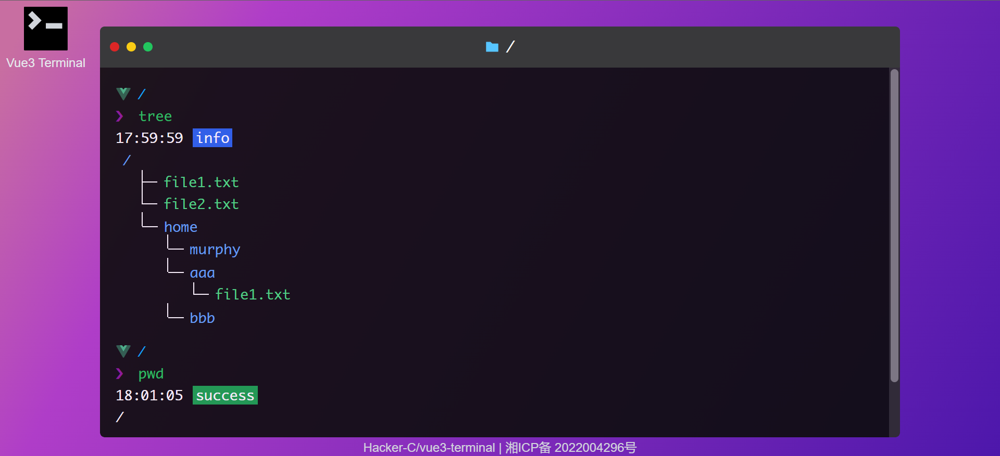

<p align='center'>
<a href='./README.md'>English</a> | 中文
</p>

# Vue3-Terminal

## About

Vue3-Terminal 是一个基于 Vue3 的迷你终端，和其他类似的前端模拟终端不同，Vue3-Term 基于 *N叉树*，实现了一些基本的 cd、mkdir、pwd、touch、clear 等命令。

在线访问: http://terminal.mphy.top



一些已经实现的具有最基本功能的命令：

- `tree` - 将文件和文件夹以树结构展示
- `echo [message]` - 打印信息
- `echo [message] > [filename]` - 文件写入
- `echo [message] >> [filename]` - 文件内容追加
- `cat [filename]` - 文件读取
- `cd [dirname]` - 改变当前目录
- `cd ..` - 返回上一级目录
- `ls` - 列出当前目录下的文件和目录（文件显示白色，文件夹显示绿色）
- `pwd` - 打印当前目录
- `clear` - 清屏
- `mkdir [dirname]` - 创建目录
- `touch [filename]` - 创建文件
- `welcome` - 欢迎信息
- `help` - 帮助信息
- `google [keywords]` - 在 Google 搜索关键词
- `baidu [keywords]` - 在百度搜索关键词
- `github` - 打开项目源码地址

更多命令将会被添加.

## Framework and library

- Vue3 + TypeScript + Vite
- Pinia
- TailwindCSS
- unplugin-auto-import + unplugin-vue-components: API 和 components 自动按需导入

## Develop

我使用了 [unplugin-auto-import](https://github.com/antfu/unplugin-auto-import) 和 [unplugin-vue-components](https://github.com/antfu/unplugin-vue-components) 来自动导入 api 和 components，需要在 vite.config.ts 中设置进行配置，具体位置如下所示。在第一次运行 `pnpm dev` 或者需要更新配置时，将 `enabled` 设置为 `true`，其他时候设置为 `false`。这样就可以在第一次运行 `pnpm dev` 或者需要更新时，自动生成 `.eslintrc-auto-import.json`，解决 eslint 报错问题。

```ts
// vite.config.ts, Ln 26, Col 7
eslintrc: {
  // 默认为 false，第一次运行或者需要更新配置时请开启，其他时候关闭
  enabled: true, 
  filepath: './.eslintrc-auto-import.json'
}
```

然后就可以愉快的开发了~
```bash
# Install
pnpm install
# Run
pnpm dev
# Build
pnpm build
```

> **Warning**  
> 每次创建新命令，推荐在 `src/store/commands` 下新建一个模块文件（格式参考已经写好的命令），新建文件后需要重新启动项目以使得 auto-imports 生效。

## Descriptiton

这个终端系统的数据结构是一个 *N叉树（N-ary Tree）*，它模拟了真机的目录结构，以便实现新建文件和目录等功能。但是有一点不同，我设计了一个指针属性 `previous`，指向它的父节点，以便实现 `cd ..` 命令。

>  **Note**  
> 更多关于 N 叉树的知识: [N-ary Tree Data Structure](https://www.studytonight.com/advanced-data-structures/nary-tree)

目录类型的结构：
```ts
interface Directory {
  id: number  // id
  name: string // 当前目录名称
  files: File[] // 当前目录下的文件列表
  directories: Directory[]   // 当前目录下的子目录列表，同时也是指向子目录的指针
  previous: Directory | null // 指向父目录的指针
}
```

文件类型的结构：
```ts
interface File {
  name: string // file name
  value: string // file content
}
```